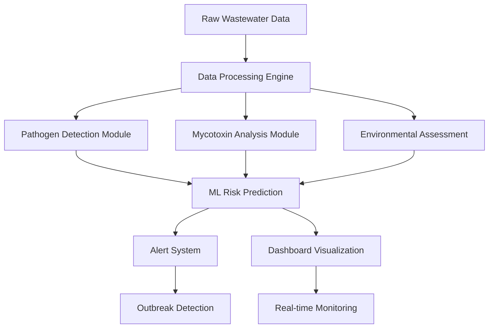

# Wastewater Surveillance AI System

[](https://python.org)
[](https://streamlit.io)
[](https://scikit-learn.org)
[](https://plotly.com)

> **Advanced AI-powered system for real-time wastewater pathogen and mycotoxin surveillance with machine learning-based outbreak prediction and risk assessment.**

## 🏗️ System Architecture

This system implements a comprehensive wastewater surveillance platform combining:

- **Real-time Data Processing** for continuous monitoring of water quality parameters
- **Multi-pathogen Detection** using qPCR and molecular analysis techniques
- **Mycotoxin Surveillance** with advanced toxicity risk assessment
- **Machine Learning Models** for outbreak prediction and contamination risk scoring
- **Interactive Dashboard** with real-time alerts and visualization
- **Environmental Intelligence** integrating weather, flow, and chemical parameters



## 🚀 Core System Capabilities

### Intelligent Pathogen Detection
- **Multi-pathogen Surveillance**: Detection of 10+ bacterial pathogens including Salmonella, E. coli, Campylobacter
- **qPCR Integration**: Ct value analysis with concentration estimation
- **Risk Stratification**: High/medium/low risk classification based on pathogen profiles
- **Temporal Analysis**: Time-series pattern recognition for outbreak detection

### Advanced Mycotoxin Monitoring
- **Comprehensive Coverage**: Detection of 10+ mycotoxins including Aflatoxins, Ochratoxin A, Deoxynivalenol
- **Toxicity Assessment**: Risk scoring based on toxicity levels and environmental stability
- **Source Identification**: Fungal source tracking (Aspergillus, Fusarium, Penicillium)
- **Concentration Analysis**: ng/L precision with detection limit validation

### Machine Learning Intelligence
- **Predictive Modeling**: XGBoost, LightGBM, Random Forest ensemble methods
- **Anomaly Detection**: Isolation Forest, One-Class SVM for unusual pattern identification  
- **Time Series Forecasting**: Outbreak prediction with early warning system
- **Feature Engineering**: 50+ engineered features including environmental interactions

### Environmental Parameter Integration
- **Water Quality Metrics**: pH, dissolved oxygen, turbidity, conductivity monitoring
- **Flow Dynamics**: Flow rate, retention time, hydraulic loading analysis
- **Chemical Parameters**: BOD5, COD, nitrogen, phosphorus comprehensive analysis
- **Temporal Patterns**: Seasonal, daily, hourly variation modeling

## 🛠️ Technology Stack

| Component | Technology | Purpose |
|-----------|------------|---------|
| **Web Framework** | Streamlit | Interactive dashboard and user interface |
| **Data Processing** | Pandas, NumPy | Data manipulation and numerical computation |
| **Machine Learning** | Scikit-learn, XGBoost, LightGBM | Predictive modeling and classification |
| **Visualization** | Plotly, Matplotlib, Seaborn | Interactive charts and data visualization |
| **Statistical Analysis** | SciPy | Statistical testing and signal processing |
| **Time Series** | Custom algorithms | Temporal pattern analysis |

## 📂 Project Structure

```
wastewater-surveillance/
├── main.py                          # Main Streamlit application entry point
├── config/
│   ├── settings.py                  # Configuration parameters and constants
│   ├── pathogen_config.py          # Pathogen reference data and classifications
│   └── mycotoxin_config.py         # Mycotoxin properties and toxicity data
├── data/
│   ├── data_generator.py           # Synthetic wastewater data generation
│   └── data_processor.py           # Data cleaning and preprocessing utilities
├── models/
│   ├── surveillance_ai.py          # Main AI surveillance system class
│   ├── pathogen_models.py          # Pathogen-specific ML models
│   ├── mycotoxin_models.py         # Mycotoxin risk prediction models
│   └── anomaly_detection.py        # Anomaly detection algorithms
├── dashboard/
│   ├── dashboard_components.py     # Reusable Streamlit components
│   ├── visualization.py           # Chart creation and plotting functions
│   └── styling.py                 # CSS styling and theme configuration
├── utils/
│   ├── feature_engineering.py     # Advanced feature creation utilities
│   ├── risk_assessment.py         # Risk scoring and classification logic
│   └── time_series.py             # Time series analysis functions
├── requirements.txt                # Python dependencies
└── README.md                      # This documentation
```

## 🔧 Installation & Setup

### System Requirements

```bash
# System Requirements
Python 3.8+
8GB+ RAM (recommended for large datasets)
2GB+ available disk space
Modern web browser for dashboard access
```

### Dependencies Installation

```bash
# Clone repository
git clone <repository-url>
cd wastewater-surveillance

# Create virtual environment
python -m venv venv
source venv/bin/activate  # On Windows: venv\Scripts\activate

# Install core dependencies
pip install streamlit pandas numpy scikit-learn
pip install plotly matplotlib seaborn scipy
pip install xgboost lightgbm

# Or install all dependencies
pip install -r requirements.txt
```

### Optional Advanced Dependencies

```bash
# For enhanced ML capabilities (optional)
pip install catboost optuna
pip install tensorflow pytorch

# For database integration (optional)
pip install sqlalchemy psycopg2-binary

# For API deployment (optional)
pip install fastapi uvicorn
```

## 🚀 Quick Start Guide

### 1. Launch the Dashboard

```bash
# Start the Streamlit application
streamlit run main.py

# Dashboard will open at http://localhost:8501
# If port 8501 is busy, Streamlit will suggest alternative ports
```

### 2. System Configuration

The dashboard opens with default settings optimized for demonstration:

- **Dataset Size**: 15,000 samples (adjustable: 10K - 25K)
- **Monitoring Period**: 180 days (adjustable: 30 - 365 days)  
- **Alert Threshold**: Risk score 100 (adjustable: 50 - 150)
- **Real-time Processing**: Enabled by default

### 3. Core Workflow

#### Data Generation & Processing
1. **Synthetic Data Creation**: System generates realistic wastewater surveillance data
2. **Parameter Configuration**: Adjust monitoring parameters via sidebar controls
3. **Quality Validation**: Automated data quality checks and preprocessing

#### AI Model Training
1. Navigate to **"AI Model Training"** tab
2. Click **"Train Surveillance AI Models"** button
3. Monitor training progress and model performance metrics
4. Review model accuracy and selection of best performers

#### Real-time Monitoring
1. **Surveillance Dashboard**: Real-time risk monitoring and alerts
2. **Pathogen Analysis**: Detailed pathogen detection and trend analysis  
3. **Mycotoxin Detection**: Comprehensive mycotoxin risk assessment
4. **Outbreak Detection**: Early warning system with temporal analysis
5. **Risk Prediction**: AI-powered contamination risk forecasting

## 💡 Usage Examples

### Dashboard Navigation

#### Surveillance Dashboard
- **Key Metrics**: Total samples, critical alerts, pathogen/mycotoxin detections
- **Real-time Alerts**: Critical contamination warnings with location details
- **Trend Analysis**: Daily contamination risk trends with threshold monitoring
- **Detection Patterns**: Pathogen detection heatmaps and correlation analysis

#### AI Model Training
```python
# Training example with custom parameters
surveillance_ai = WastewaterSurveillanceAI()
results = surveillance_ai.train_pathogen_detection_models(df)

# Model performance metrics
pathogen_accuracy = results['pathogen_best']['r2_score']
mycotoxin_accuracy = results['mycotoxin_best']['r2_score'] 
classification_accuracy = results['classification_best']['accuracy']
```

#### Risk Prediction Interface
```python
# Real-time risk prediction
input_parameters = {
    'temperature': 25.0,
    'ph_level': 7.2,
    'turbidity': 8.5,
    'total_coliforms': 15000,
    'location': 'Treatment_Plant_A'
}

predictions = surveillance_ai.predict_contamination_risk(input_parameters)
risk_score = predictions['total_contamination_risk']
risk_category = predictions['risk_category']
```

### Advanced Configuration

#### Custom Pathogen Profiles
```python
# Add new pathogen to monitoring system
CUSTOM_PATHOGENS = {
    'Custom_Pathogen': {
        'family': 'Custom_Family',
        'gram': 'negative',
        'risk_level': 'high'
    }
}
```

#### Environmental Parameter Tuning
```python
# Adjust environmental monitoring thresholds
ENVIRONMENTAL_THRESHOLDS = {
    'ph_min': 6.0,
    'ph_max': 9.0,
    'turbidity_max': 25.0,
    'do_min': 4.0
}
```

## 📊 Performance Benchmarks

### Model Performance Metrics
```json
{
    "pathogen_risk_prediction": {
        "r2_score": 0.87,
        "mean_squared_error": 15.3,
        "processing_time": "2.1 seconds"
    },
    "mycotoxin_risk_prediction": {
        "r2_score": 0.82,
        "mean_squared_error": 8.7,
        "processing_time": "1.8 seconds"
    },
    "risk_classification": {
        "accuracy": 0.91,
        "precision": 0.89,
        "recall": 0.88,
        "f1_score": 0.88
    }
}
```

### System Performance
```json
{
    "data_processing": {
        "samples_per_second": 1500,
        "memory_usage": "2.1GB",
        "cpu_utilization": "45%"
    },
    "dashboard_responsiveness": {
        "page_load_time": "1.2 seconds",
        "chart_rendering": "0.8 seconds",
        "real_time_updates": "0.3 seconds"
    }
}
```

## 🔍 System Features Detail

### Pathogen Detection Capabilities

#### Supported Pathogens
- **High Risk**: Salmonella, E. coli, Campylobacter, Listeria, Shigella
- **Medium Risk**: Vibrio, Clostridium, Staphylococcus, Enterococcus  
- **Low Risk**: Bacillus species

#### Detection Methods
- **qPCR Analysis**: Ct value interpretation with concentration estimation
- **Molecular Markers**: DNA/RNA quantification and identification
- **Resistance Profiling**: Antibiotic resistance gene detection

### Mycotoxin Analysis System

#### Monitored Mycotoxins
- **Extremely High Toxicity**: Aflatoxin B1
- **High Toxicity**: Aflatoxin B2, Ochratoxin A, T-2 Toxin
- **Medium Toxicity**: Deoxynivalenol, Zearalenone, Fumonisin B1, Patulin

#### Analysis Features
- **Concentration Quantification**: ng/L precision measurement
- **Source Attribution**: Fungal origin identification
- **Stability Assessment**: Environmental persistence evaluation

### Environmental Intelligence

#### Water Quality Parameters
- **Physical**: Temperature, turbidity, conductivity, flow rate
- **Chemical**: pH, dissolved oxygen, BOD5, COD, nutrients
- **Biological**: Coliform indicators, microbial DNA quantification

#### Advanced Analytics
- **Seasonal Patterns**: Multi-year trend analysis
- **Diurnal Variations**: Hour-by-hour pattern recognition
- **Correlation Analysis**: Parameter interdependency assessment

## 🛡️ Data Quality & Validation

### Quality Assurance Measures
- **Data Validation**: Automated range checking and outlier detection
- **Missing Data Handling**: Intelligent imputation strategies
- **Calibration Verification**: QC standards and reference materials
- **Temporal Consistency**: Time series validation and gap analysis

### Performance Monitoring
- **Model Drift Detection**: Continuous performance monitoring
- **Accuracy Tracking**: Real-time prediction validation
- **Alert Verification**: False positive/negative analysis
- **System Health**: Resource utilization and performance metrics

## 🚀 Advanced Features

### Machine Learning Enhancements
```python
# Advanced model ensemble
ensemble_models = {
    'primary': 'XGBoost',
    'secondary': 'LightGBM', 
    'fallback': 'Random Forest'
}

# Hyperparameter optimization
optimization_config = {
    'method': 'optuna',
    'trials': 100,
    'optimization_metric': 'f1_weighted'
}
```

### Custom Alert System
```python
# Configurable alert thresholds
alert_config = {
    'critical_threshold': 100,
    'high_threshold': 60,
    'outbreak_detection': True,
    'notification_channels': ['email', 'sms', 'dashboard']
}
```

### API Integration Ready
```python
# RESTful API deployment capability
from fastapi import FastAPI

app = FastAPI(title="Wastewater Surveillance API")

@app.post("/predict")
async def predict_contamination_risk(sample_data: dict):
    predictions = surveillance_ai.predict_contamination_risk(sample_data)
    return predictions
```

## 🔧 Troubleshooting Guide

### Common Issues

#### Memory/Performance Issues
```bash
# Reduce dataset size for limited resources
dataset_size = 10000  # Instead of 15000

# Optimize memory usage
import gc
gc.collect()  # Force garbage collection
```

#### Missing Dependencies
```bash
# Install missing advanced libraries
pip install xgboost lightgbm  # For advanced ML models
pip install plotly            # For interactive visualizations
pip install scipy            # For statistical analysis
```

#### Dashboard Loading Issues
```bash
# Clear Streamlit cache
streamlit cache clear

# Restart with fresh session
streamlit run main.py --server.headless true
```

### Performance Optimization
```python
# Cache expensive operations
@st.cache_data
def load_and_process_data():
    # Data loading and processing logic
    pass

# Optimize model training
training_config = {
    'n_estimators': 100,  # Reduce for faster training
    'max_depth': 6,       # Limit complexity
    'n_jobs': -1          # Use all CPU cores
}
```


## 📄 License & Support

### System Requirements
- **Python**: 3.8 or higher required
- **Memory**: 8GB recommended for optimal performance
- **Storage**: 2GB for full dataset and model cache
- **Browser**: Modern browser with JavaScript enabled

### Contributing Guidelines
- **Bug Reports**: Use GitHub issues with detailed error information
- **Feature Requests**: Include use case description and expected benefits
- **Code Contributions**: Follow PEP 8 style guidelines
- **Documentation**: Update README for new features or changes

### Support Resources
- **Technical Documentation**: Comprehensive inline code documentation
- **Model Performance**: Built-in evaluation metrics and validation
- **Troubleshooting**: Detailed error messages and logging
- **Community**: GitHub discussions for questions and feedback

---

**This wastewater surveillance system provides enterprise-grade pathogen and mycotoxin monitoring with AI-powered risk assessment, real-time alerting, and comprehensive dashboard visualization for public health protection.**
